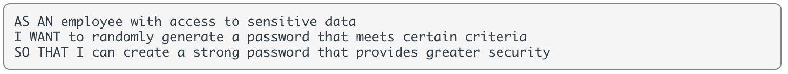
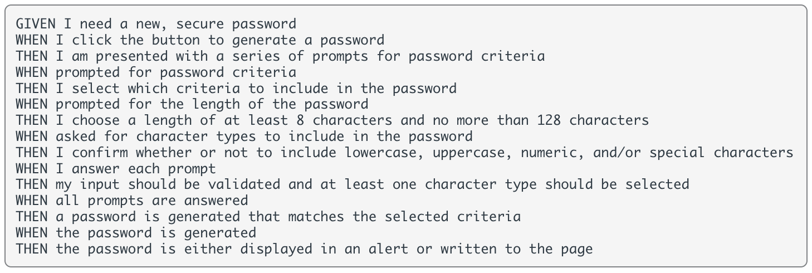
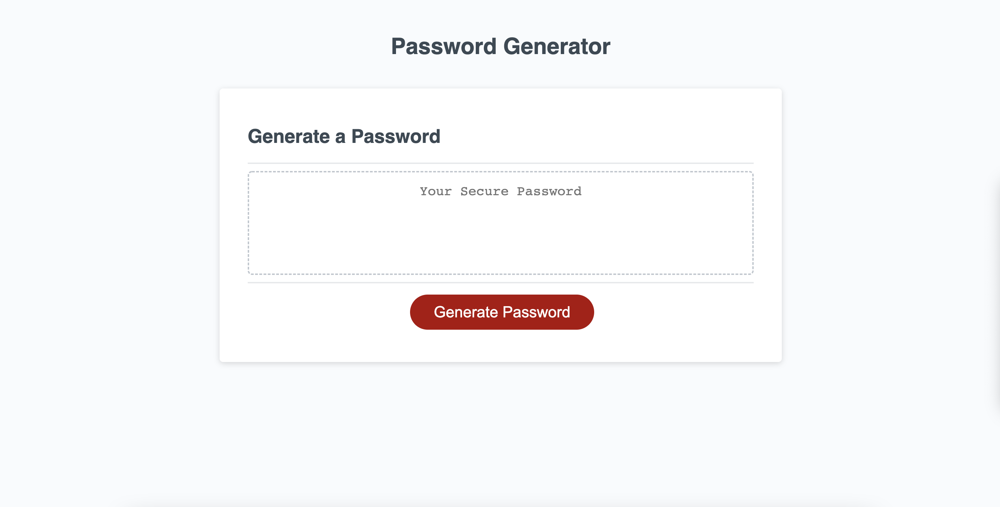
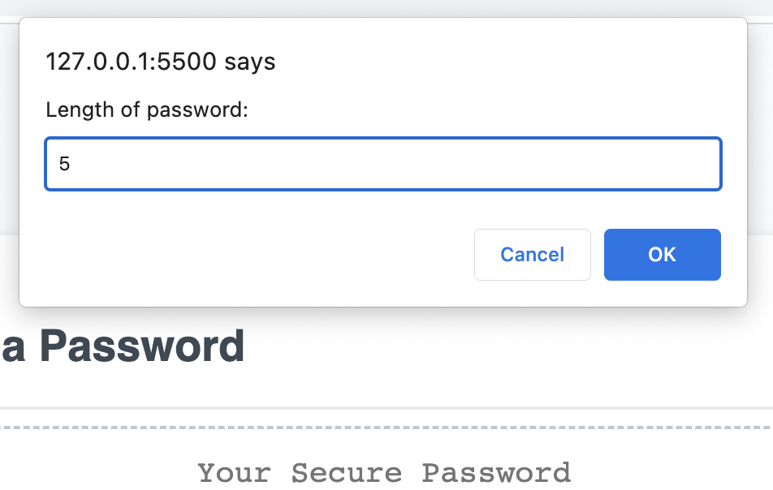
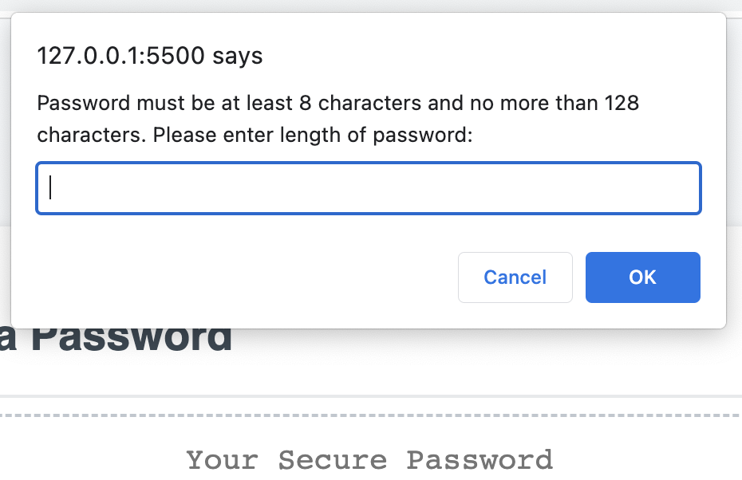
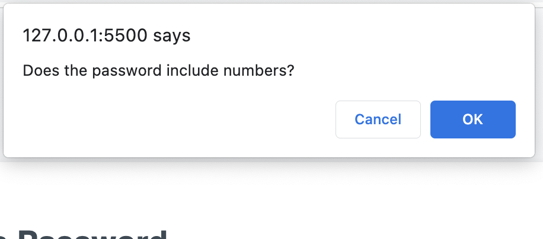
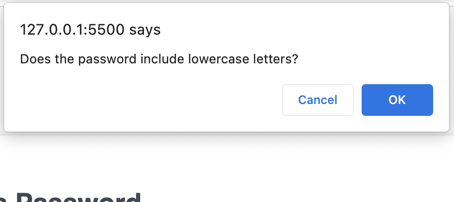
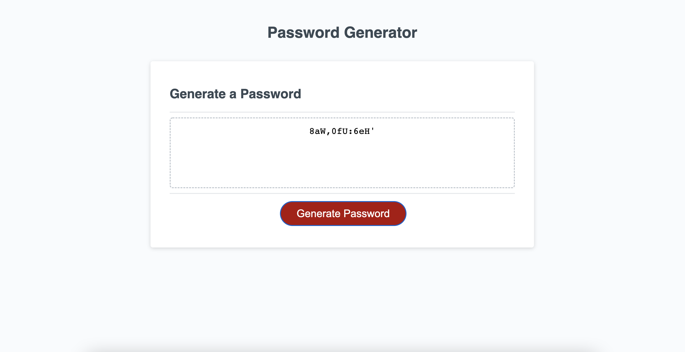

# w3-password-generator

Week Three Challenge of the *UOB Full Stack Development Coding Bootcamp* requires students to use JavaScript to create a **password generator**. 

We were given a User Story and an Acceptance Criteria as per below:

User Story:

 

Acceptance Criteria:

 

## How I approached the task:

* Analysed the starter code from which I understood is used to display the generated password in the password text area of the HTML. 

* Broke the task down into smaller chunks - started by focusing on how to generate a random number / letter / special char.

```
// GENERATOR FUNCTIONS:
// Get ONE random number:

var numbers = "0123456789";

function getRandomNumbers() {
  randomNumbers = numbers.charAt(Math.floor(Math.random() * numbers.length));
  return randomNumbers;
} 
```

* Worked on creating the windows dialog box pop-up, by using the .prompt() and .confirm() methods I was able to generate a value from the user input.

```
function writePassword() {
  pwLength = +window.prompt("Length of password: ");

  //check is pw length is between 8 and 129 chars

  while (pwLength < 8 || pwLength > 130) {
    pwLength = +window.prompt("Password must be at least 8 characters and no more than 128 characters. Please enter length of password: ");
  };

  hasNumbers = window.confirm("Does the password include numbers?");
  hasLowercase = window.confirm("Does the password include lowercase letters?");
...
}
```

* Created a **generatePassword()** funtion which filters out user selection, and a **for loop** to loop over **pwLength** and call the random generator functions **getRandomNumbers()**.

```
function generatePassword (number, lower, upper, special, pwLength) {
  let generatedPassword = "";
  const typesCount = number + lower + upper + special;
  
  // filter out user selection

  const typesArr = [{number}, {lower}, {upper}, {special}].filter
  (
    item => Object.values(item)[0]
  );

  //if user values return false, we generate/return nothing

  if(typesCount === 0) {
    return "";
  }

  //loop over length and call random generator functions

  for(let i = 0; i < pwLength; i += typesCount) {
    typesArr.forEach(type => {
      const funcName = Object.keys(type)[0];
      generatedPassword += randomFunc[funcName]();
    });
  }
  const finalPassword = generatedPassword.slice(0,pwLength);
  return finalPassword;
}
```

* In between these steps, I also ran **console.log()** to ensure I am getting the result required.

## Screenshot of Deployed Application:

 

## Screenshot of Application Interaction:

 

 

 

 

There is also an alert for the user to confirm uppercase letters and special characters, once all confirm() and prompt() methods are satisfied, a password is generated in the #password text area. 

 

## URL to Deployed Application:

[Click here](https://priscillaluong.github.io/week-one-challenge/) 

### Final note:

*Any feedback to improve code or areas where I could further implement best practice would be greatly appreciated* 😊
