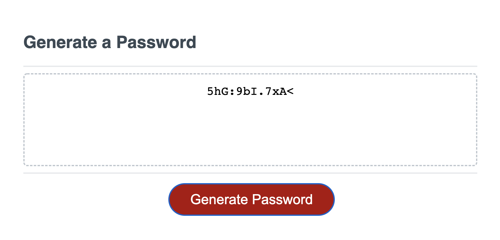

# w3-password-generator

Week Three Challenge of the *UOB Full Stack Development Coding Bootcamp* requires students to use JavaScript to create a **password generator**. 

We were given a User Story and an Acceptance Criteria as per below:

User Story:

 

Acceptance Criteria:

 

## How I approached the task:

* Broke the task down into smaller tasks - analysed the starter code from which I understood that used to display the generated password in the password text area on your HTML.

* worked by focusing on how to generate a random number / letter / special char. Listed under the GENERATOR FUNCIONS comment: 

* Worked on creating the alerts on the windows dialog box. By using the .prompt() and .confirm() methods I was able to generate a value.

* Used objects with key: value 

* In between this, I ran a console.log at different parts to make sure I am getting the result I need.

```
/********************************
* Content Section (Left) *
*********************************/
.content {
    /*Positioning*/
    width: 75%;
    display: inline-block;
    margin-left: 20px;
}

.search-engine-optimization,
.online-reputation-management,
.social-media-marketing {
    /*Positioning*/
    margin-bottom: 20px;
    padding: 50px;
    height: 300px;
    /*Styling*/
    font-family: 'Gill Sans', 'Gill Sans MT', Calibri, 'Trebuchet MS', sans-serif;
    background-color: #0072bb;
    color: #ffffff;
}
```
## Screenshot of Deployed Application:

 

## Screenshot of Application Interaction:

 

 

 

 

There is also an alert for the user to confirm uppercase letters and special characters, once all confirm() and prompt() methods are satisfied, a password is generated in the #password text area. 

 

## URL to Deployed Application:

[Click here](https://priscillaluong.github.io/week-one-challenge/) 

